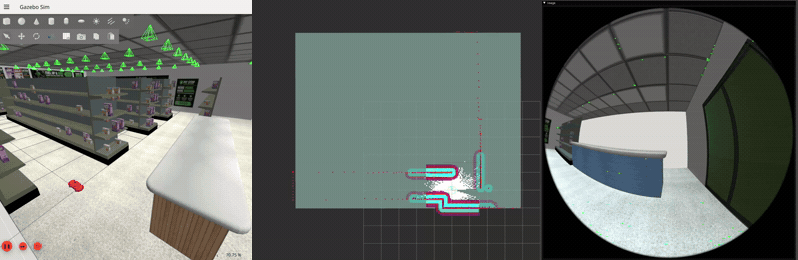

<div align="center">

# Stocktake

Autonomous stocktaking robot for retail and industrial environments

</div>



**Stocktake** is a simulation of RFID-aided autonomous stocktake, intended for use in retail and industrial environments. It is able to autonomously map new environments, conduct rounds of simulated RFID scanning, and then display the results to the end-user over a web interface.

For the simulation, we use `gazebo (harmonic)`, with a custom `gazebo-rfid-plugin` that is able to simulate realistic RFID interaction between tag and reader. We also procedurally generate the simulated environment (currently a retail store) at launch-time. Included in the simulation is a set of models of common stocktake items, supplied with RFID tag to represent scannable objects.

Our stocktake process is split into a mapping/route construction phase, and a stocktake phase. We use ROS2 as the middleware for this implementation, with a `stocktake-orchestration` node for maintaining an internal state-machine and providing a server endpoint for control via the web interface, `stocktake-frontend` which is a simple next.js UI.

We can select between four different robot models, each with a different sensor array: lidar, depth camera, stereo cameras, mono camera.

For the autonomy stack, we use `Nav2` for path planning and local control of the robot, which is differential wheeled robot. For the lidar-based robot, we use `slam-toolbox` for mapping and for the other models, we use `stella-vslam` for visual-slam mapping. The latter also use `octomap` for an efficient octree-based map representation from which we extract a 2D occupancy grid. All robot models use a fork of `m-explore-ros2`, which has a frontier-based algorithm for map exploration. Lastly, we use `nvidia-swagger` for waypoint and route construction in our mapped environment.

## Installation
Currently, the only tested/supported combination is Ubuntu 24.04, with ros2-jazzy and gz-harmonic. At the very least we need ROS2 Jazzy (specifically [ros2-jazzy-desktop](https://docs.ros.org/en/jazzy/Installation/Ubuntu-Install-Debs.html)) and Gazebo simulator (harmonic).

To clone the repository and submodules
```bash
mkdir -p ~/ros2_ws/src
cd ~/ros2_ws/src
git clone --recurse-submodules https://github.com/bulbeckh/stocktake.git
```

#### Docker setup
```bash
## Build image
sudo docker build -f docker/Dockerfile -t stocktake .

## Start container
sudo docker compose up dev
sudo docker compose exec dev bash

## Source our ROS2 env
source /opt/ros/jazzy/setup.bash
```

Build our packages
```bash
cd /workspaces/stocktake-alt
colcon build --symlink-install
source ./install/setup.bash
```

## Launching
We have four different robot types to choose from, each differing based on the camera array. Currently, `rgbd` is the most stable.

| Robot Type | Description |
| --- | --- |
| `lidar` | Lidar scanner, slam_toolbox, nav2 |
| `rgbd` | Depth camera, stella-vslam, nav2 |
| `stereo` | Dual color cameras, stella-vslam, nav2 |
| `mono` | Single color camera, stella-vslam, nav2 |

If running in docker, need to run on the host:
```bash
xhost +local:docker
```

#### Launching navigation
Our `stocktake_core` packages handles all the simulation bringup and navigation stack. We supply the robot type here as a launch arg.
```bash
ros2 launch stocktake_core launch3.py robot_type:=<lidar, rgbd, stereo, mono>
```

If we are using a visual-slam based robot model (rgbd, stereo, or mono), we need to run stella-vslam.
```bash
source /workspaces/stocktake-vslam/install.setup.bash
ros2 launch stocktake_core vslam_launch.py
```

#### Launching orchestration
Our orchestration node handles transitions between stocktake phases and web interface communication.
```bash
ros2 run stocktake_orchestration stocktake_orchestration
```

#### Launching frontend
Our frontend a simple next.js web UI.
```bash
cd /workspaces/stocktake-alt/src/stocktake/stocktake-frontend/frontend

## Run npm server
npm run dev
```

#### Launching explore
TODO This needs to be launched as part of the 'core' bringup, not as a standalone node
```bash
ros2 launch explore_lite explore.launch.py
```

#### Launch swagger node
The swagger nodes requires us to be in the virtual env that contains the `nvidia-swagger` python package.
```bash
source /.venv/bin/active
ros2 run stocktake_nvidia_swagger server_node
```

## Packages and dependencies
| Package | Description |
| --- | --- |
| `stocktake_core` | Nodes for mapping and autonomous navigation (Nav2) and simulation (Gazebo) |
| `stocktake_orchestration` | Nodes for robot state machine and interface with frontend |
| `stocktake_nvidia_swagger` | Nodes for waypoint generation from map, via nvidia-swagger package |
| `stocktake_nvidia_swagger_msgs` | Custom messages for waypoint generation |
| `stocktake_frontend` | Frontend for stocktake/robot control web interface
| `explore-ros2-action` | Fork of [m-explore-ros2](https://github.com/robo-friends/m-explore-ros2) frontier-based exploration algorithm, with action server instead of node auto-start |
| `gazebo-rfid-plugin` | RFID scanning system plugin for Gazebo sim, modelling realistic RFID scan effects |

## Autonomy Stack
NOTE: Still experimenting with mapping/navigation stacks, including visual SLAM implementations.

`TODO` We use the [Navigation2](https://github.com/ros-navigation/navigation2) ROS2 package for the planning, control, state estimation, and behaviour tree.

Map exploration is currently done using a frontier-based exploration algorithm from `m-explore-ros`.

Stella-VSLAM provides us with stereo (and mono) camera-based SLAM from which we can extract a world representation.

### Libraries
- [OpenBase](https://github.com/GUiRitter/OpenBase) Omni Wheel STL files
- [Navigation2](https://github.com/ros-navigation/navigation2) Navigation planners, costmaps

